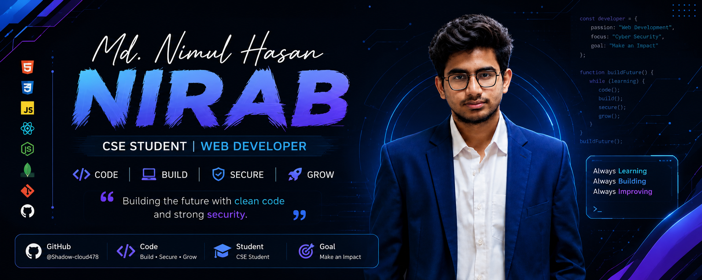

<div align="center">



<br><br>


<br>


</div>

<br>

---

<div align="center">

# ✦ `HELLO, WORLD!`

### I'm **Nimul** — a CSE student who loves building things for the web.

</div>

<br>

<table>
<tr>
<td width="55%" valign="top">

### 👋 A little about me

I'm **MD. Nimul Hasan Nirab**, a Computer Science & Engineering student and web developer.

My current journey is taking me from **frontend development → full-stack development → AI → cyber security**.

I learn by building real projects, experimenting with new technologies, making mistakes, and figuring out how to fix them.

<br>

**Currently exploring**

🌐 Full-Stack Development
🤖 AI-powered applications
🔐 Cyber Security
🧠 Problem Solving
⚙️ Backend Architecture

</td>

<td width="45%" align="center">


</td>
</tr>
</table>

---

<div align="center">

# 🎨 `MY DIGITAL TOOLBOX`

### I don't just collect technologies — I use them to build things.

<br>


</div>

<br>

<div align="center">

### The colors belong to the technologies. 🌈

|    | Technology         | What I'm doing with it            |
| -- | ------------------ | --------------------------------- |
| 🟠 | **HTML**           | Structuring the web               |
| 🔵 | **CSS**            | Designing interfaces              |
| 🟨 | **JavaScript**     | Building interactive applications |
| 🔷 | **TypeScript**     | Writing safer JavaScript          |
| ⚛️ | **React**          | Creating component-based UIs      |
| ▲  | **Next.js**        | Exploring modern full-stack React |
| 🟢 | **Node.js**        | Learning backend development      |
| 🍃 | **MongoDB**        | Exploring NoSQL databases         |
| 🐬 | **MySQL**          | Working with relational data      |
| 🐧 | **Linux**          | Understanding systems             |
| 🔐 | **Cyber Security** | Learning how systems stay secure  |

</div>

---

# 🌌 `MY LEARNING UNIVERSE`

<div align="center">

```text
                         ✦
                         │
              ┌──────────┴──────────┐
              │                     │
           FRONTEND              BACKEND
              │                     │
        ┌─────┴─────┐        ┌──────┴──────┐
        │           │        │             │
      React       Next.js   Node.js       APIs
        │           │        │             │
        └─────┬─────┘        └──────┬──────┘
              │                     │
              └──────────┬──────────┘
                         │
                       FULL
                       STACK
                         │
              ┌──────────┴──────────┐
              │                     │
             AI                 SECURITY
              │                     │
          LLM Apps              Linux
          AI Agents            Networking
          Automation           Web Security
```

</div>

<br>

<table>
<tr>
<td width="50%" align="center">

## 🌐 FULL-STACK

**Frontend**

React
Next.js
JavaScript
TypeScript

**Backend**

Node.js
Express
REST APIs
Databases

</td>

<td width="50%" align="center">

## 🔐 CYBER SECURITY

**Learning**

Linux
Networking
Web Security
OWASP

**Exploring**

Authentication
Application Security
Security Fundamentals

</td>
</tr>
</table>

---

# 🚀 `PROJECT TRANSMISSION`

<div align="center">

### Ideas → Code → Experiments → Projects

</div>

<br>

<table>
<tr>

<td width="33%" align="center">

### 🌐 WEB

**Frontend Experiments**

React interfaces
Responsive websites
Interactive UI

`HTML` `CSS` `JS` `REACT`

</td>

<td width="33%" align="center">

### 🤖 AI

**AI Experiments**

AI applications
LLM integrations
Multi-agent systems

`NEXT.JS` `AI` `LLM`

</td>

<td width="33%" align="center">

### 🔐 SECURITY

**Security Lab**

Web security
Linux
Networking

`LINUX` `NETWORKING`

</td>

</tr>
</table>

---

<div align="center">

# ⚡ `HOW I LEARN`

<br>


</div>

---

# 📊 `GITHUB // ACTIVITY`

<div align="center">


<br><br>


</div>

---

<div align="center">

# 🐍 `THE CONTRIBUTION GARDEN`

### Every little square is a day I showed up.

<br>


<br>

`░` Quiet    `▒` Active    `▓` Productive    `█` Deep Work

</div>

---

# 🧩 `CURRENTLY EXPLORING`

<table>
<tr>
<td align="center" width="25%">

### ⚛️

**React**

Component architecture
State management
Modern UI

</td>

<td align="center" width="25%">

### ▲

**Next.js**

App architecture
APIs
Full-stack React

</td>

<td align="center" width="25%">

### 🤖

**AI**

LLMs
AI applications
Agents

</td>

<td align="center" width="25%">

### 🔐

**Security**

Linux
Networking
Web security

</td>
</tr>
</table>

---

<div align="center">

# 🧠 `THE MINDSET`

<br>

> ### **Don't just copy the code.**
>
> ### **Understand the code.**

<br>

`Curiosity` → `Experiment` → `Failure` → `Debugging` → `Understanding` → `Growth`

</div>

---

# 🌱 `THE ROAD AHEAD`

```text
                 ┌──────────────────┐
                 │    CSE STUDENT   │
                 └────────┬─────────┘
                          │
                          ▼
                 ┌──────────────────┐
                 │  WEB DEVELOPMENT │
                 └────────┬─────────┘
                          │
                          ▼
                 ┌──────────────────┐
                 │      REACT       │
                 └────────┬─────────┘
                          │
                          ▼
                 ┌──────────────────┐
                 │     NEXT.JS      │
                 └────────┬─────────┘
                          │
                          ▼
                 ┌──────────────────┐
                 │   FULL-STACK     │
                 └────────┬─────────┘
                          │
                   ┌──────┴──────┐
                   ▼             ▼
                ┌──────┐     ┌──────────┐
                │  AI  │     │ SECURITY │
                └──┬───┘     └────┬─────┘
                   │              │
                   └──────┬───────┘
                          ▼
                   🚀 KEEP BUILDING
```

---

<div align="center">

# 💬 `LET'S CONNECT`

<br>

<a href="https://github.com/YOUR_USERNAME">

</a>

<a href="https://linkedin.com/in/YOUR_LINKEDIN_USERNAME">

</a>

<a href="mailto:YOUR_EMAIL">

</a>

<br><br>


<br><br>

### `Thanks for entering my corner of GitHub.`

**— MD. Nimul Hasan Nirab**

<br>


</div>
